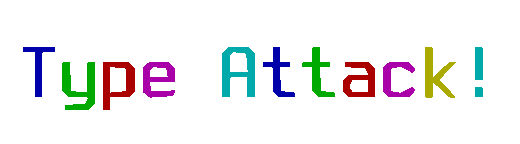




[](https://oldgame-proyect.itch.io/typeattack)
  <a href="https://ko-fi.com/sromandev"></a>

Type Attack is a high-performance terminal typing game written in C11. It features real-time input verification, per-character animated rainbow feedback, a dynamic difficulty and leveling engine, and persistent cross-platform scoring.

---

## Features

- Real-Time Keystroke Validation: Instant per-character visual feedback.
- Animated Rainbow Effect: Dynamically cycles color palettes on matching characters.
- Error Highlighting: Immediate red indicator on character mismatches.
- Event Log Console: Split vertical sidebar displaying real-time session events.
- Dual Feedback System: Contextual messages loaded from `congrats` and `loser` dictionaries.
- Dynamic Progression Engine: Falling speed scales proportionally with player level.
- Cross-Platform Persistence:
  - Windows: Native Windows Registry (`HKCU\Software\TypeAttack`).
  - Linux / POSIX: XOR-obfuscated local storage verified via SHA-256 integrity checksum.
- Zero Bloat: Native compilation targeting Win32 / POSIX terminal subsystems without heavy runtime dependencies.

---

## Directory Structure

```
.
|-- CMakeLists.txt       # Build system configuration
|-- build.bat            # Automated build script for Windows
|-- run.bat              # Automated launch script for Windows
|-- icon.ico             # Application executable icon
|-- resource.rc          # Windows resource and version metadata definition
|-- words                # Primary dictionary of falling sentences
|-- congrats             # Motivational message bank
|-- loser                # Taunt message bank
|-- includes/            # PDCurses header files
|-- libs/                # Precompiled static libraries (pdcurses.lib, pdcurses.a)
`-- source/              # Engine source code and technical documentation
```

---

## Controls

| Key | Action |
| --- | --- |
| `[A-Z]` / `[0-9]` / `[Space]` | Type active falling sentence |
| `[Backspace]` | Delete previous character |
| `[Esc]` | Return to menu / Exit game |
| `[Up]` / `[Down]` | Navigate menu options |
| `[Enter]` | Confirm menu selection |

---

## Building and Running

### Prerequisites
- CMake 3.10 or higher
- Windows: MSVC (Visual Studio 2017+) or MinGW
- Linux: GCC / Clang, `libncurses5-dev` / `libncursesw5-dev`

### Windows (MSVC)
```cmd
cmake -B build -A Win32 .
cmake --build build --config Debug
.\build\Debug\TypeAttack.exe
```
Or execute the automated batch script:
```cmd
.\build.bat
```

### Linux / POSIX
```bash
cmake -B build .
cmake --build build
./build/TypeAttack
```

---

## License

GPL3.0. Copyright OLDGAME-Proyect (C) 2026.
